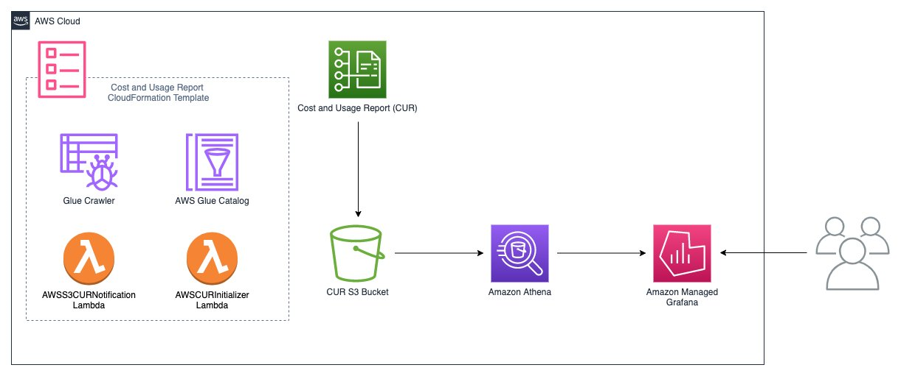

# Use this code to configure the below setup in your aws account.

```
Below architecture diagram will explain you how to configure the AWS cost usage report in Grafana.
this module configured accordingly.

```

